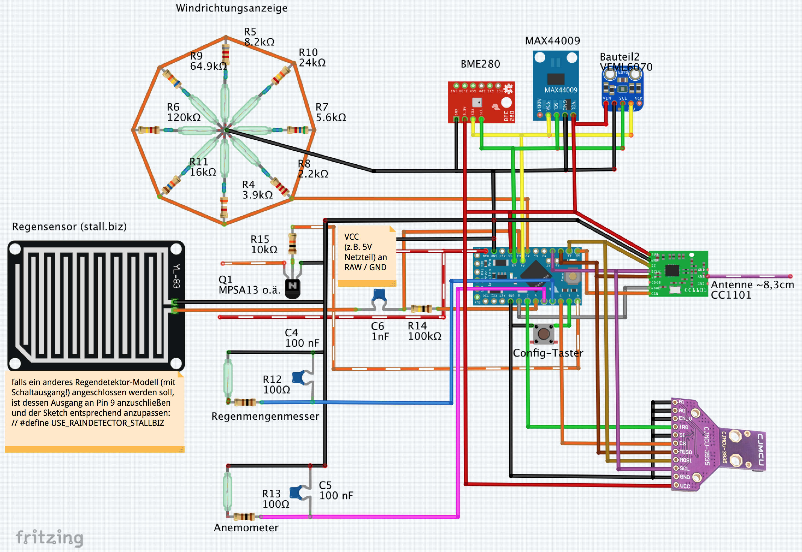

# HB-UNI-Sen-WEA V1.2 _(benötigt [Addon Version V1.8](https://github.com/jp112sdl/JP-HB-Devices-addon/releases/latest) oder höher)_
## Selbstbau-Wetterstation (mit Netzteilbetrieb) für HomeMatic 

 

#### Code
- verwendete Bibliotheken:
  - _[BH1750](https://github.com/claws/BH1750) Helligkeitsensor (nach Möglichkeit den MAX44009 Sensor einsetzen, dieser hat einen wesentlich größeren Messbereich und benötigt keine Lib)_
  - [BME280](https://github.com/finitespace/BME280) Temperatur / Feuchte / Luftdruck

#### Hardware (Elektronik)
- benötigte Bauteile _(ohne Gewähr, dass es sich um die preiswertesten Angebote handelt!)_:
  - [CC1101 (868MHz)](https://de.aliexpress.com/item/CC1101-Wireless-Module-Long-Distance-Transmission-Antenna-868MHZ-M115-For-FSK-GFSK-ASK-OOK-MSK-64/32635393463.html) 
  - [Arduino Pro Mini 3.3V/8MHz](https://de.aliexpress.com/item/Free-Shipping-1pcs-pro-mini-atmega328-Pro-Mini-328-Mini-ATMEGA328-3-3V-8MHz-for-Arduino/32342672626.html)
  - [VEML6070](https://www.ebay.de/itm/183207531222)
  - [BME280](https://www.ebay.de/itm/253107395109)
  - [Reed-Kontakte](https://www.ebay.de/itm/263000077321)
  - _[BH1750](https://www.ebay.de/itm/162351871499) (nicht mehr empfohlen - der MAX44009 hat einen größeren Messbereich)_
  - [MAX44009](https://www.ebay.de/itm/162727018038)
  - [AS3935](https://de.aliexpress.com/item/New-AS3935-lightning-sensor-Lightning-lightning-lightning-detection-storm-distance/32830108558.html)
  - ein paar Widerstände (Werte bitte dem Schaltplan entnehmen) und einen Taster

#### Gehäuse-/Konstrukt-Teile
Rahmen + Anemometer + Windrichtungszeiger + Regenmengenmesser 
https://www.thingiverse.com/thing:2849562

Halterung für die Platine + Sensoren: 
https://www.thingiverse.com/thing:2821592

Neodym-Magenete: [eBay-Link](https://www.ebay.de/itm/180935986047)  
Kugellager: [eBay-Link](https://www.ebay.de/itm/251368539841)

#### Schaltplan

_Hinweis: Die LED wird nicht mehr benutzt und braucht daher nicht verbaut zu werden._

#### Abgleich Windrichtungsanzeiger

Damit der Windrichtungsanzeiger ordnungsgemäß arbeitet, muss er abgeglichen werden. 
Dabei müssen für alle 16 Positionen die Messwerte am analogen Eingang A2 ermittelt werden. 
Die ermittelten 16 Werte müssen anschließend in das Array `HB-UNI-Sen-WEA.ino`[(Zeile 39)](https://github.com/jp112sdl/HB-UNI-Sen-WEA/blob/724c120519640d56590500ac2d985ecd0458dfc7/HB-UNI-Sen-WEA.ino#L39) 
`const uint16_t WINDDIRS[] = { 33 , 71, 51 ..., 41 };` 
eingetragen werden. 
Der 1. Wert entspricht Norden, dann geht es in 22,5° Schritten im Uhrzeigersinn weiter.  

Es empfiehlt sich, die Analog-Werte des Widerstandzirkels **vor** dem Flashen der `HB-UNI-Sen-WEA.ino` zu ermitteln. 
Zu diesem Zweck flasht man den Sketch `WinddirResistorTest/WinddirResistorTest.ino` auf den Arduino Pro Mini. 
Unmittelbar danach ist im seriellen Monitor (57600 Baud) der gemessene Analogwert zu sehen (`A2 = ...`). _Die Ausgabe von `idx = ` ist hier irrelevant._  
Diesen Wert notieren und den Windrichtungsmesser langsam im Uhrzeigersinn weiterbewegen, bis der nächste Wert zu erscheint. 
Das ganze Prozedere sollte 1x ringsum 16 verschiedene Analogwerte ergeben. 
Man kann diese nun ins Array [(Zeile 13)](https://github.com/jp112sdl/HB-UNI-Sen-WEA/blob/724c120519640d56590500ac2d985ecd0458dfc7/WinddirResistorTest/WinddirResistorTest.ino#L13) und den Sketch erneut flashen. 
Zur Kontrolle sollte der Index des Arrays der Windrichtung angezeigt werden (`idx = `).  

Sind alle Werte ermittelt, können sie nun ins Array des eigentliches Sketches `HB-UNI-Sen-WEA.ino`[(Zeile 39)](https://github.com/jp112sdl/HB-UNI-Sen-WEA/blob/724c120519640d56590500ac2d985ecd0458dfc7/HB-UNI-Sen-WEA.ino#L39), wie bereits oben erwähnt, eingetragen werden. 

#### Addon für die CCU / RaspberryMatic

**Um die Geräteunterstützung zu aktivieren, wird die aktuellste Version des [JP-HB-Devices Addon](https://github.com/jp112sdl/JP-HB-Devices-addon/releases/latest) benötigt!**

Einstellungen: 

- Sendeintervall
  - Sendeintervall :)
- Höhe über NN
  - Höhe der Station über dem Meeresspiegel (für die barometrische Luftdruckberechnung erforderlich)
- Max. Sendeversuche
  - _nur relevant für bidirektionale Meldungen (Regen, Böen)_
- Anemometer Radius (cm)
  - Abstand zwischen Mitte Achse und Mitte Becher
- Anemometer Calibration Factor
  - Multiplikator, um den eigenen Windwiderstand auszugleichen
- Blitzdetektor Kapazität
  - Kapazitätsangabe der besten Abstimmung auf 500kHz
- Blitzdetektor Störererkennung
  - automatisches Unterdrücken von Störimpulsen
- zusätzliche Benachrichtigung bei Böen über
  - wird die eingestelle Böengeschwindigkeit überschritten, werden unmittelbar die Daten gesendet 
  
_Wird über einen angeschlossenen Regensensor Regen erkannt, wird sofort dies sofort zur Zentrale gesendet!_
  
 Bedienung: 

